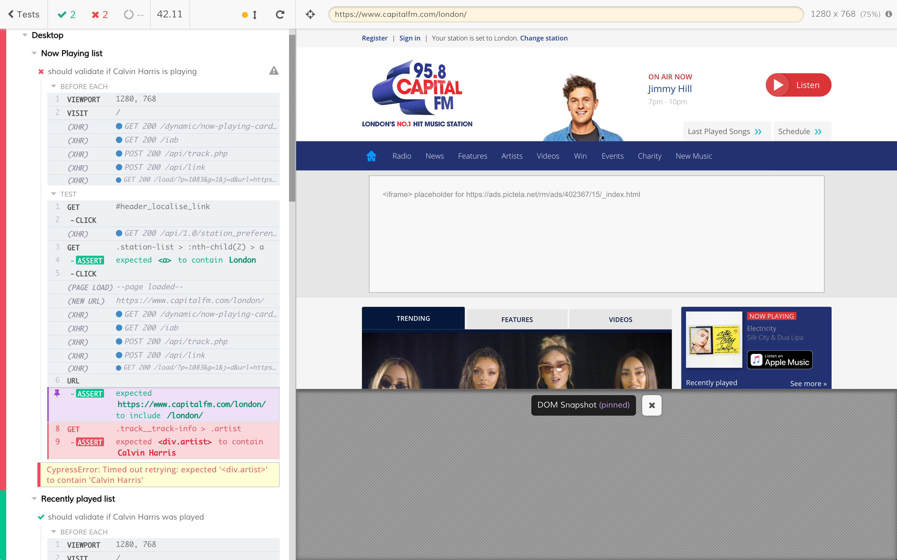

# CITY-FM-LONDON CHALLENGE: 

Write Automated tests for https://www.capitalfm.com/digital/

**Scenario 1**: Validate if Calvin Harris is 'playing' on **Now playing List** at 'Capital FM London'.

**Scenario 2**: Validate if Calvin Harris was 'played' on **Recently played list** at 'Capital FM London'.

# The test suite

I have built the test using [Cypress](https://www.cypress.io/). The suite contains 4 tests.

## To run the cypress test

Go to main directory, run `npm install` then `npm start`.

To run them on a headless browser: `npm run headless`

## Questions and Answer

The rest of the questions and answers can be found in Questions and Answer folder. [Q&A](https://github.com/wonmaungthein/City-FM-London-challenge/blob/master/Questions%26Answers/Q%26A.md)

## Some notes

- On desktop, clicking on the location in header menu will give option to choose London station
- On mobile, the top-level links only toggle the submenu (the submenu items then give the option for the user to select the London station)